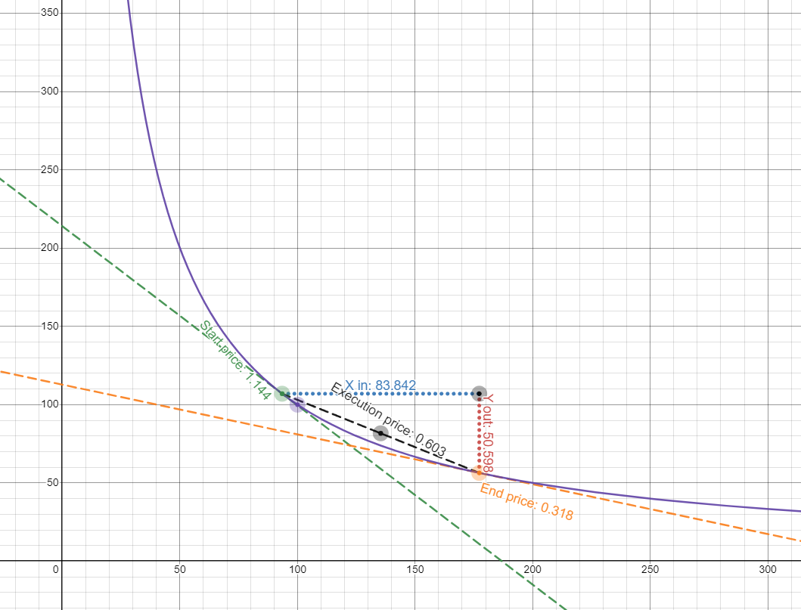

# Comprendre les bases d'Uniswap 🦄

N'hésitez pas à cliquer sur les deux fichiers "base.js" et "avance.js" afin de mieux comprendre le fonctionnement d'Uniswap et des Pools de liquidités.

## Voici un Schéma explicatif 👍

## Essayez par vous même 👍

https://www.desmos.com/calculator/7wbvkts2jf?lang=fr

**Pour retrouver les mêmes valeurs :**
- Cliquez à gauche sur "18 Calculations" afin de déployer le menu
- Dans "22", mettez la valeur à 107